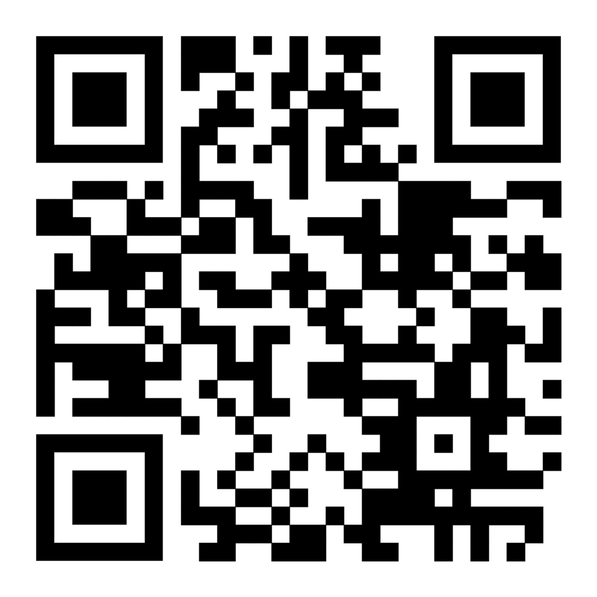

# Digital Resume Project

🌱 **Eco-Friendly, Accessible, and Developer-Validated Resume**  

A static webpage version of my resume built with HTML/CSS/JS, designed to:  

## Key Advantages  

### ♻️ Eco-Conscious Solution  
- **Eliminates paper waste**: No need to print multiple copies—just share a link or QR code.  
- **QR Code Portability**: Recruiters can scan to access the latest version instantly (printed QR codes use less ink than full resumes).  
- **Always up-to-date**: No outdated physical copies circulating.  

### 💻 Web Development Showcase  
- **Hand-coded HTML/CSS/JS**: Demonstrates front-end proficiency without frameworks.  
- **Responsive Design**: Adapts to phones, tablets, and desktops.  
- **Language Toggle**: Dynamic English/French switching with JavaScript.  
- **GitHub Hosting**: Proves familiarity with static site deployment.  

### 🚀 Professional Edge  
- **Live Interaction**: Links to projects, LinkedIn, and GitHub for deeper engagement.  
- **Analytics Ready**: Can integrate tracking to measure recruiter interest (optional).  
- **PDF Fallback**: Includes a print-friendly CSS version for traditional requests.  

## Technical Stack  
- **HTML5** (semantic structure)  
- **CSS3** (flexbox, responsive design)  
- **JavaScript** (language toggle, localStorage)  
- **GitHub Pages** (hosting)  

## How to Use  
1. **Web Access**: Visit [your-github-io-link]()  
2. **QR Code**: Scan or print:  
     
3. **PDF Export**: Press `Ctrl+P` → "Save as PDF" (styled for printing).  

---

**Why This Matters**  
This project reflects my commitment to sustainability while validating technical skills—exactly the kind of innovative thinking modern employers value.  
